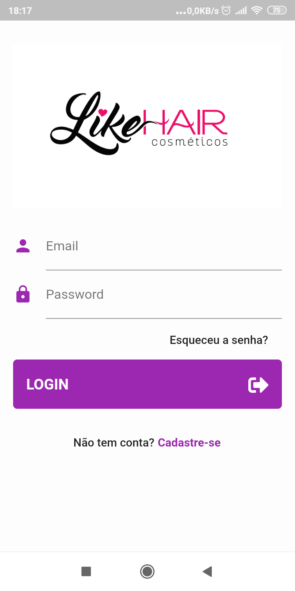
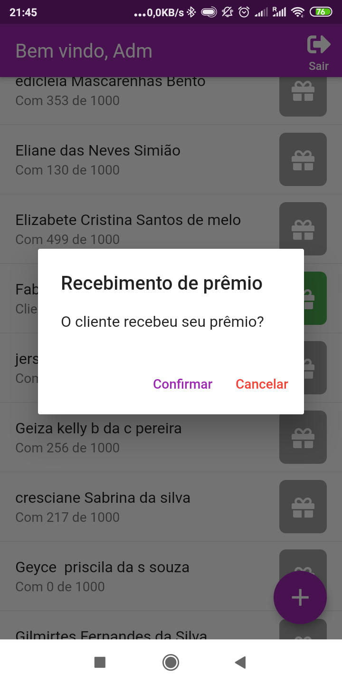

# Fidelike

Um aplicativo criado em Flutter para um cliente que tem a principal funcionalidade gerenciar pontuação de fidelidade para a LikeHair Cosméticos e seus clientes.

#### Funcionalidades:
* 2 perfis de usuário (Admin e User)
* Admin pode dar pontos, retirar pontos
* Admin pode ver usuários e editar dados cadastrais
* Admin pode visualizar os pontos dados ao usuário
* Admin entrega o prêmio e reseta a pontuação
* Usuário pode visualizar o histórico de pontos recebidos com quantidade de pontos e data
* Usuário pode visualizar o prêmio que receberá
* Usuário visualiza os pontos que possui em forma de gráfico

